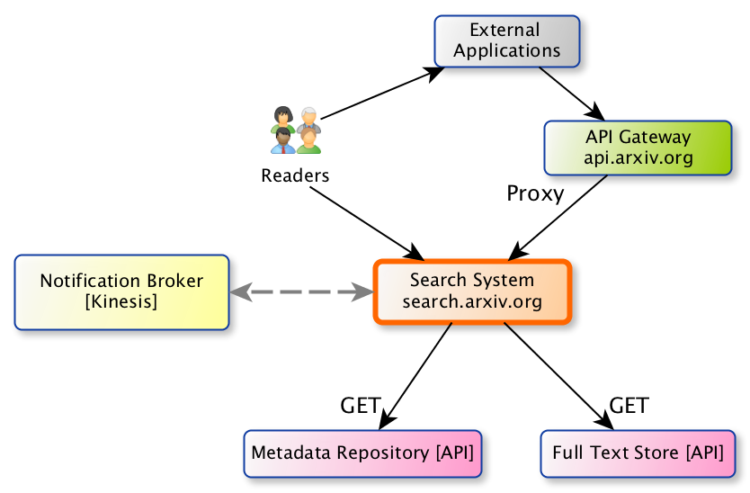
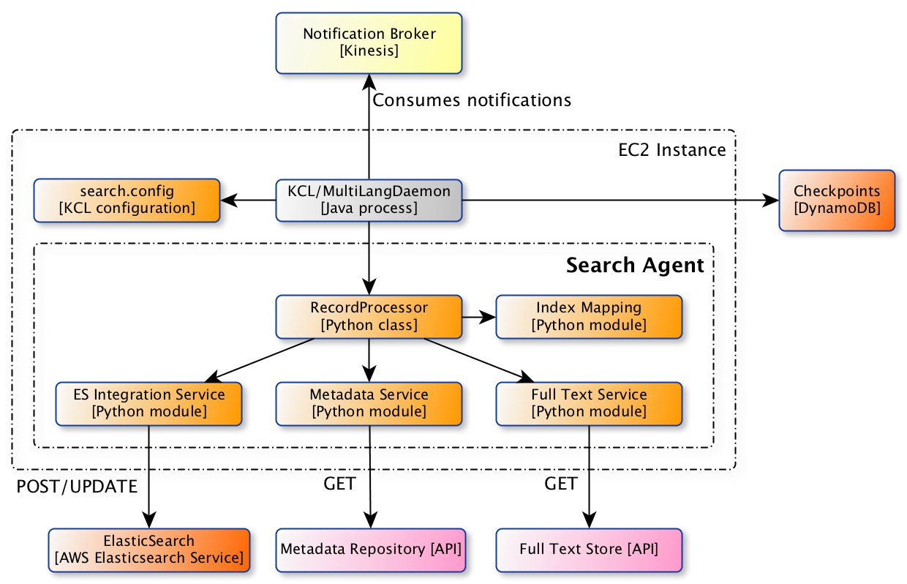
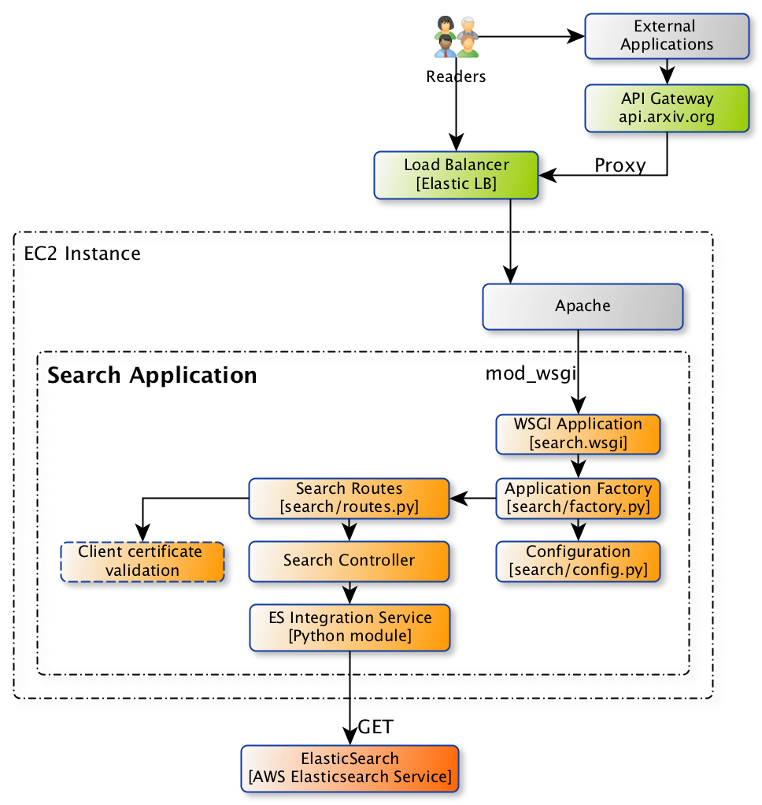

arXiv Search
************

Key Requirements
================

- Readers should be able to search for arXiv publications via a modern, fast,
  faceted search interface.
- Searches should make use of full text content to increase the relevance of
  results.
- External API consumers should be able to perform searches RESTfully
  via the arXiv API gateway.
- The search index should be updated automatically in response to system
  notifications about new content.
- Maintain look-and-feel of classic arXiv system.

Quality Goals
=============

- 99% of search requests (browser and API) serviced in 100 milliseconds or
  less.
- 90% unit test coverage on Python components that we develop/control.
- API documentation to include:

  - Request/response parameters for all available methods;
  - Examples for all available methods;
  

Constraints
===========

- Browser-facing and API applications must be implemented in Python/Flask, and
  be deployable in AWS ElasticBeanstalk as a Python/WSGI application.
- Notifications about new content are delivered via the Kinesis notification
  broker.

Context
=======

.. _figure-ng-search-context:

   System context for arXiv search.

The arXiv search system provides a faceted search experience to arXiv readers,
as a part of the core arXiv website. Readers can search by specific metadata
fields, and by full-text content. The search system also supports future
development to improve relevance, paper suggestions (e.g. based on the paper
that the reader is currently viewing), and suggestions based on reading
history.

The search system also provides programmatic access to arXiv metadata via
the API Gateway. API consumers can perform complex searches via RESTful APIs.
Resources provided by the API are linked to resources provided by other APIs
in the arXiv system, to facilitate discovery.

Finally, the search system acts as a secondary data store for some other arXiv
subsystems within the :ref:`enhancement & discovery area of concern
<enhancement-and-discovery>`. For example, the RSS feed API.

The search system subscribes to notifications about new publications and
full text content brokered by AWS Kinesis. When the full text content is
available, the search system retrieves the relevant metadata and content from
the :ref:`publication-metadata-store` and plain text store, respectively, and
updates the search index.

Subsystems
==========

.. _figure-ng-search-subsystems:

.. figure:: _static/diagrams/ng-search-subsystems.png
   :target: _static/diagrams/ng-search-subsystems.png

   Subsystem view of arXiv search.

The core of the search system is an ElasticSearch index, provided by the `AWS
Elasticsearch Service <https://aws.amazon.com/elasticsearch-service/>`.

The search application, implemented in Flask and deployed on EC2, provides
both the user-facing interface and REST API. The search application is only
responsible for reading from ES. The REST API routes are proxied by the API
Gateway; those routes use client certificate validation to limit requests to
the gateway only.

An agent application is responsible for coordinating updates to the ES index.
The agent subscribes to notifications about the availability of plain text for
new publications delivered by the Kinesis broker. The agent makes requests
to the metadata repository and the plain text store, transforms those data
into a search document, and sends that document to ES. The agent is deployed
in a private subnet.

Components
==========

Search agent
------------

.. _figure-ng-search-agent-components:

   Components view of the search agent.

The search agent implements the :ref:`agent role <agents>` in the generic
architecture.

Notification handling is provided by two components: a notification consumer
provided by Amazon, implemented using the Java-based Kinesis Consumer
Library, and a record processor component implemented in Python that
processes new notifications received by the consumer. A so-called
MultiLangDaemon, a stand-alone Java process, provides the glue between the
KCL and our record processor. When new notifications are received by the
consumer, the MultiLangDaemon invokes the record processor, which in turn
starts the processing pipeline.

The :class:`search.agent.RecordProcessor` implements a method called for each
notification. That method coordinates retrieval of metadata and text content
from their respective data stores, transformation of those content into a
search document, and updating ElasticSearch. Integration with external services
are provided by service components. A transformation component encapsulates
the production of the search document from input metadata and full text.

Search application + API
------------------------

.. _figure-ng-search-application-components:

   Components view of the search agent.

The search application provides browser-based access to readers, and also
provides a REST API for programmatic access via the API Gateway. This
application is implemented in Flask.

Browser-based and API-based requests are handled by separate routes. API-based
routes should validate client certificates to limit traffic to the API
gateway only.

.. note:
   It may be acceptable to use a lightweight client-side application for the
   faceted search interface, if it would substantially enhance user
   experience.

See the :ref:`web-application-architecture` documentation for details.
