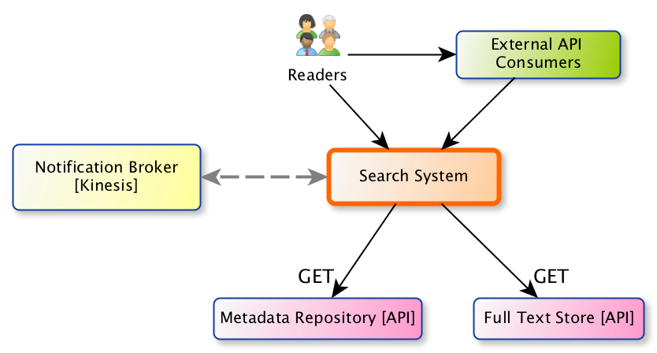
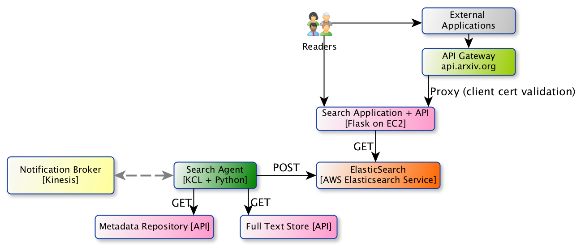
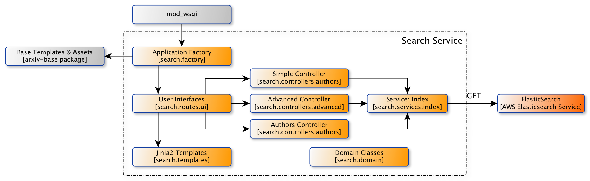
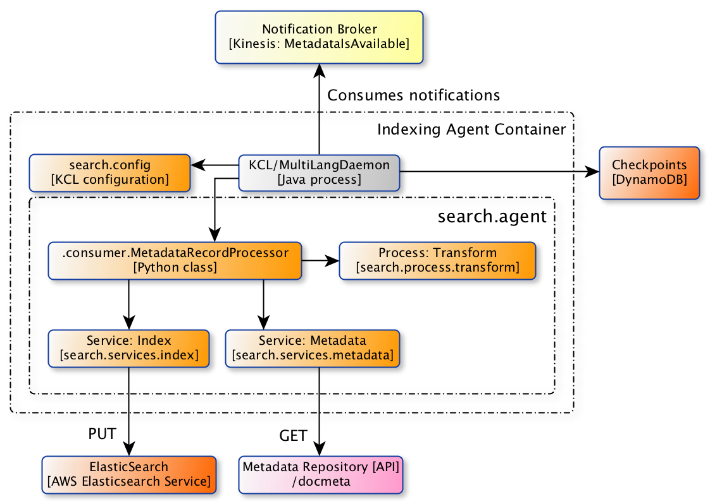

arXiv Search
************

The current version of the arXiv search application is designed to meet the
goals outlined in arXiv-NG milestone H1: Replace Legacy Search.

- H1.1. Replace the current advanced search interface, search results, and
  search by author name.
- H1.2. The search result view should support pagination, and ordering by
  publication date or relevance.
- H1.3. An indexing agent updates the search index at publication time in
  response to a Kinesis notification, using metadata from the docmeta endpoint
  in the classic system.

Key Requirements
================

- Simple search:

  - Users should be able to search for arXiv papers by title, author, and
    abstract.
  - Searches can originate from any part of the arXiv.org site, via the
    search bar in the site header.

- Advanced search:

  - Users can search for papers using boolean combinations of search terms on
    title, author names, and/or abstract.
  - Users can filter results by primary classification, and submission date.
  - Submission date supports prior year, specific year, and date range.

- Author name search:

  - Users should be able to search for papers by author name.
  - This should support queries originating on the abs page, and in search
    results.

- UI: The overall flavor of the search views should be substantially
  similar to the classic views, but with styling improvements that improve
  readability/usability.

Quality Goals
=============
- Code quality:

  - 90% test coverage on Python components that we develop/control.
  - Linting: ``pylint`` passes with >= 9/10.
  - Documentation: ``pydocstyle`` passes.
  - Static checking: ``mypy`` passes.

- Performance & reliability:

  - Response time: 99% of requests have a latency of 1 second or less.
  - Error rate: parity with classic search.
  - Request rate: support request volume of existing search * safety factor 3.

- Meet or exceed WCAG 2.0 level A for accessibility.

Constraints
===========
- Must be implemented in Python/Flask, and be deployable behind Apache as a
  Python/WSGI application.
- The search application itself must be stateless. It must be able to connect
  to an arbitrary ElasticSearch cluster, which can be specified via
  configuration.
- Notifications about new content are delivered via the Kinesis notification
  broker.

Context
=======
.. _figure-ng-search-context:

   System context for arXiv search.

The arXiv search system supports queries about arXiv papers both from human
users and from API clients (via the arXiv API gateway). Most readers arrive
at the search interface via a small search bar in the running header of
arxiv.org pages, or by clicking on the name of an author on the abstract page
or other listings.

The search system draws content from the core metadata repository (currently
the classic arXiv application, via the ``/docmeta`` endpoint), and (future)
from the fulltext extraction service.

Notifications about new content are disseminated by the publication system via
a Kinesis stream. When metadata and/or the full text content (future) is
available, the search system retrieves the relevant metadata and content from
the metadata store and plain text store (future), respectively, and updates the
search index.

In the future, the search system may be used to support other discovery tools
and APIs, including the RSS feeds.

Containers
==========

.. _figure-ng-search-subsystems:

   Container view of arXiv search.

The core of the search system is an ElasticSearch cluster, provided by the `AWS
Elasticsearch Service <https://aws.amazon.com/elasticsearch-service/>`.

The search service, implemented in Python/Flask, provides both the user-facing
interfaces as well as a REST API. The search service is only responsible for
reading from ElasticSearch.

The indexing agent application is responsible for coordinating updates to the
ElasticSearch cluster. The agent subscribes to notifications about the
availability of metadata and/or plain text (future) for new publications
delivered by the Kinesis broker. The agent makes requests to the metadata
repository and the plain text store (future), transforms those data into a
search document, and sends that document to ES.

Components: Search service
==========================

.. _figure-ng-search-application-components:

   Components of the search service.

The search service is a Flask application that handles user/client requests to
search arXiv papers.

The entry-point to the application is the application factory module, which
provides :func:`search.factory.create_ui_web_app`. That application factory
function attaches templates and static files from `arxiv-base
<https://github.com/cul-it/arxiv-base>`_ for use in search-specific templates,
and attaches the routing blueprint provided by :mod:`search.routes.ui`.

:mod:`search.routes.ui` routes parameters from incoming requests to the three
main search controllers:

- :mod:`search.controllers.authors`
- :mod:`search.controllers.simple`
- :mod:`search.controllers.advanced`

These are implemented separately, rather than trying to accommodate all
use-cases in one controller, because we expect user interface methods to change
significantly as enhanced features are introduced. Each controller module
implements its own classes for form handling and validation.

Components: Indexing agent
==========================

.. _figure-ng-search-indexing-agent-components:

   Components view of the search agent.

Notification handling is provided by two components: a notification consumer
provided by Amazon, implemented using the Java-based Kinesis Consumer
Library, and a record processor component implemented in Python that
processes new notifications received by the consumer. A so-called
MultiLangDaemon, a stand-alone Java process, provides the glue between the
KCL and our record processor. When new notifications are received by the
consumer, the MultiLangDaemon invokes the record processor, which in turn
starts the processing pipeline.

The :class:`search.agent.consumer.MetadataRecordProcessor` implements the
indexing procedure for each notification. The
:meth:`search.agent.consumer.MetadataRecordProcessor.process_record` method
coordinates retrieval of metadata from the docmeta endpoint (classic),
transformation of those content into a search document, and updating
ElasticSearch.
